# Expense Tracker — Frontend

A modern **Expense Tracker web application** built with **Angular 22** for managing personal expenses, budgets, categories, notifications, and user account information.

The application uses Angular's modern standalone APIs, Signals, Angular Material, Bootstrap, JWT-based authentication, SignalR for real-time communication, and a combination of Vitest and Playwright for testing.

---

## Features

### Authentication & Account Management

* User registration and login
* JWT-based authentication
* Automatic access-token refresh using refresh tokens
* Persistent authentication state using browser `localStorage`
* Route protection using authentication guards
* Forgot password workflow
* Password reset workflow
* User profile management
* Account settings
* Change email
* Change password
* Logout

The application initializes the authentication state when the application starts and attempts to refresh an expired access token when a refresh token is available.

### Dashboard

The dashboard provides an overview of the user's financial activity, including:

* Expense summaries
* Budget information
* Expense-by-category data
* Daily expense information
* Recent expenses
* Budget utilization information
* Visual data representation using Chart.js

### Expense Management

* View expenses
* Create expenses
* Edit expenses
* Filter expenses
* Search expenses
* Paginate expense results
* Sort expense results
* Filter by date range
* Filter by amount
* Filter by category
* Filter by budget
* Export expenses

### Budget Management

* View budgets
* Create budgets
* Edit budgets
* View individual budget details
* View expenses associated with a budget
* Navigate directly to a specific budget

### Category Management

* View categories
* Edit categories
* View individual category details
* Navigate directly to a specific category

### Notifications

* View notifications
* Track unread notifications
* Display unread notification count
* Mark notifications as read
* Receive real-time notifications
* Display notification toast messages
* Navigate from notifications to related application resources

The application includes dedicated notification and SignalR/realtime services.

### Responsive Layout

The authenticated application uses an Angular Material sidenav layout.

On desktop-sized screens, the navigation sidebar is displayed alongside the application content. On mobile devices, the sidebar switches to an overlay mode and can be opened using a menu button.

The layout also displays the currently authenticated user's profile information and notification count.

---

## Screenshots

### Landing Page

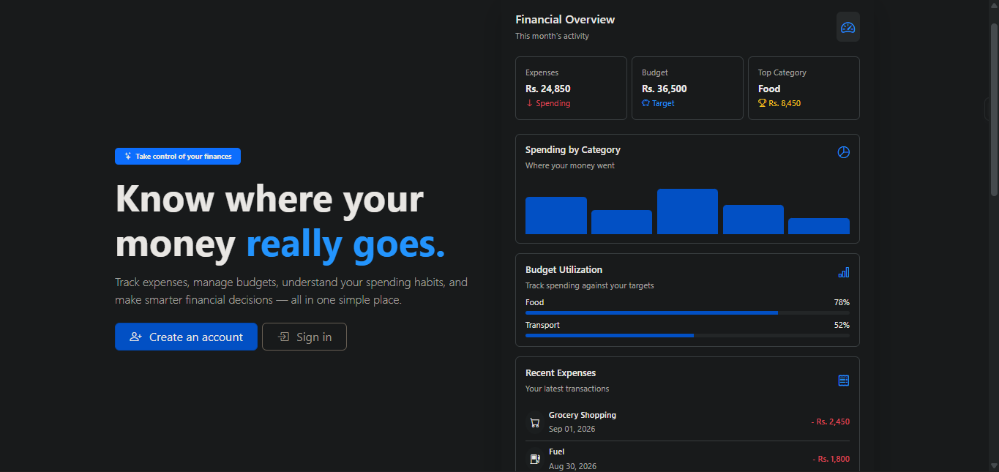
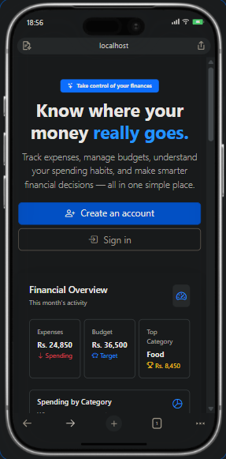

### Login Page

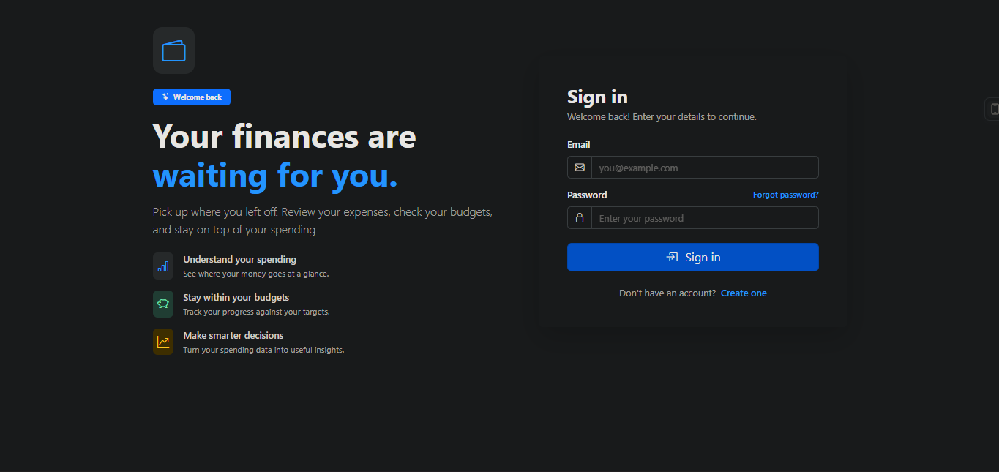

### Register Page

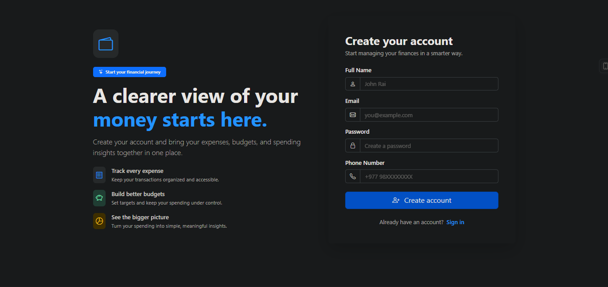

### Dashboard

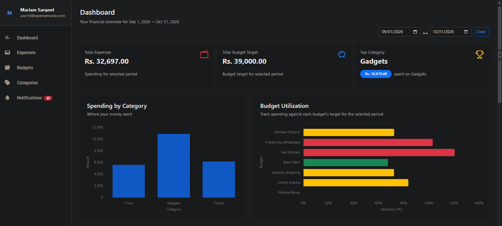
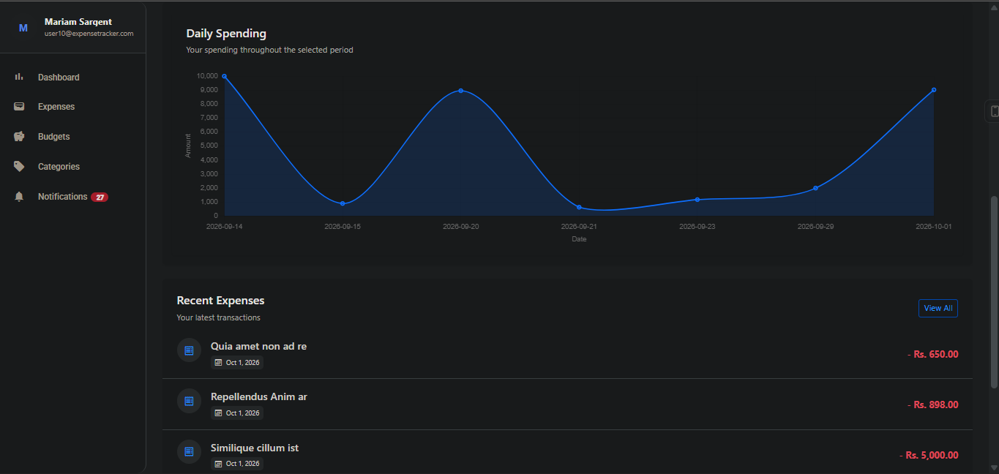

### Responsive Layout

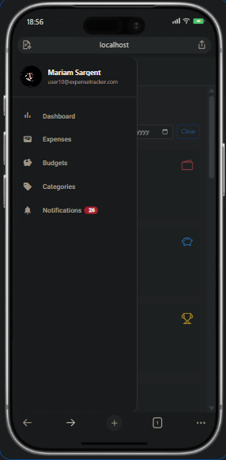

### Expense Management

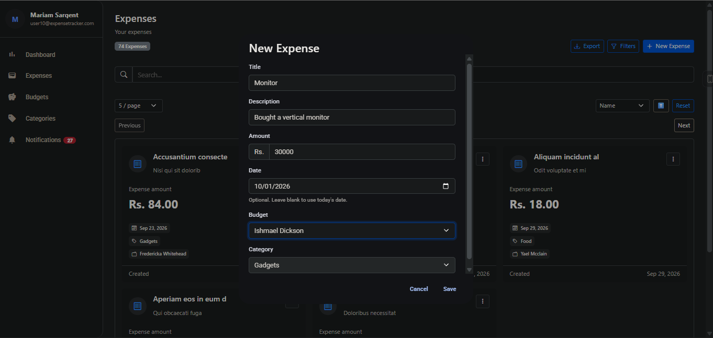

### Budget Management

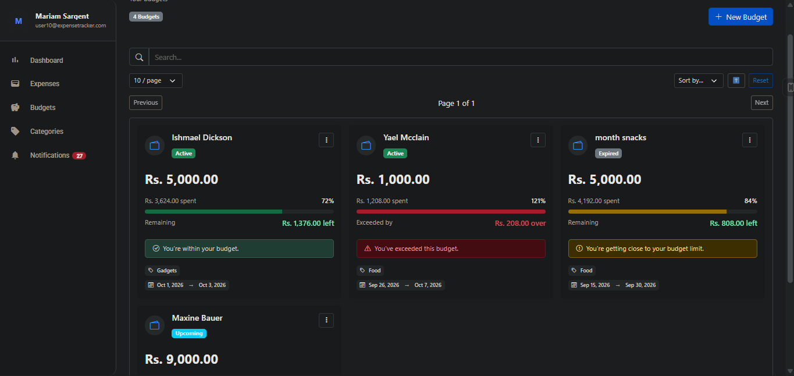

### Category Management

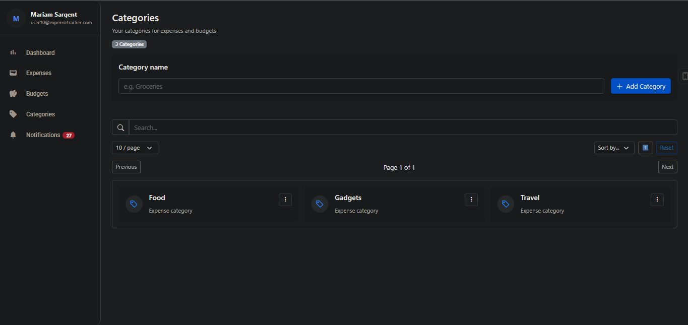

### Notifications

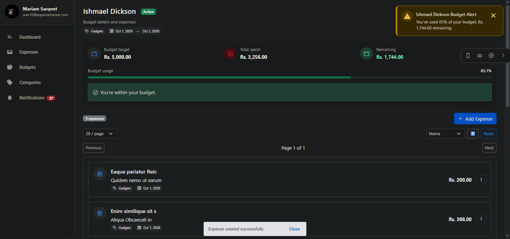
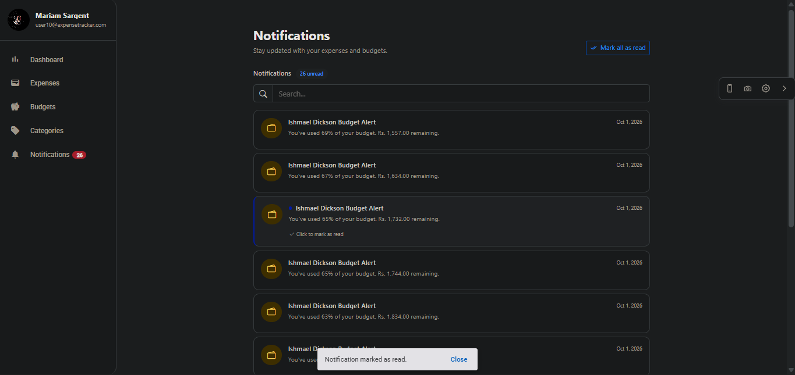

---

## Tech Stack

### Core

* **Angular 22**
* **TypeScript 6**
* **RxJS 7.8**
* **Angular Router**
* **Angular Signals**

### UI

* **Angular Material 22**
* **Angular CDK 22**
* **Bootstrap 5**
* **ng-bootstrap**
* **Bootstrap Icons**

### Authentication

* JWT authentication
* `jwt-decode`
* HTTP interceptors
* Route guards
* Refresh-token flow

### Real-time Communication

* **Microsoft SignalR**

### Data Visualization

* **Chart.js**

### Forms

* Angular Forms
* Angular Signal Forms

### Testing & Code Quality

* **Vitest**
* **Playwright**
* Angular testing utilities
* Angular ESLint
* ESLint
* Prettier
* jsdom

---

## Architecture

The application follows a feature-oriented Angular structure.

```text
src/
└── app/
    ├── account-setting/
    ├── budgets/
    │   ├── budget-detail/
    │   ├── create-budget-dialog/
    │   └── edit-budget-dialog/
    ├── categories/
    │   ├── category-detail/
    │   └── edit-category-dialog/
    ├── dashboard/
    ├── expenses/
    │   ├── create-expense-dialog/
    │   └── edit-expense-dialog/
    ├── forgot-password/
    ├── home/
    ├── interceptor/
    ├── layout/
    ├── login/
    ├── models/
    ├── notifications/
    ├── profile/
    ├── register/
    ├── reset-password/
    ├── services/
    └── shared/
```

The project separates:

* Feature components
* Services
* Models
* Shared reusable components
* Application-level routing
* Authentication infrastructure
* Reusable state classes

The project structure includes dedicated models for authentication, expenses, budgets, categories, dashboard data, notifications, pagination, search, filtering, profile management, and account settings.

---

## Application Routing

The application separates public routes from authenticated application routes.

### Public Routes

```text
/
├── login
├── register
├── forgot-password
└── reset-password
```

These routes are protected by the `notLoggedInGuard`, preventing authenticated users from accessing authentication pages.

### Authenticated Routes

```text
/layout
├── dashboard
├── expenses
├── budgets
│   └── :budgetId
├── categories
│   └── :categoryId
├── notifications
├── profile
└── account-setting
```

Authenticated routes are protected by the `loggedInGuard`.

The application also uses lazy loading for the authenticated layout route and preloads application routes using Angular's `PreloadAllModules` strategy.

---

## Authentication

Authentication is managed through a dedicated `AuthService`.

The service maintains the current authenticated user using an Angular Signal:

```typescript
readonly isAuthenticated = computed(
  () => this.currentUser() !== undefined
);
```

Authentication state is persisted in browser `localStorage`.

When the application starts:

1. The stored authentication state is retrieved.
2. The access token expiration is checked.
3. A valid token restores the authenticated state.
4. An expired token triggers a refresh-token request when possible.
5. If refreshing fails, the authentication state is cleared.

The application registers this initialization process using Angular's `provideAppInitializer`.

### JWT Interceptor

Authenticated HTTP requests automatically receive:

```http
Authorization: Bearer <access-token>
```

The interceptor also handles HTTP `401 Unauthorized` responses.

When an authenticated request receives a `401`:

1. The refresh token is requested.
2. The authentication state is updated with the new token.
3. The original request is retried with the new access token.
4. If refreshing fails, the authentication state is cleared.

Concurrent refresh requests are shared so that multiple failed requests do not unnecessarily trigger multiple refresh operations.

---

## State Management

The frontend uses **Angular Signals** for lightweight local and application state rather than relying on a separate state-management library.

Reusable state classes are used for common UI concerns.

### Pagination State

The `PaginationState` abstraction manages:

* Current page
* Page size
* Sort field
* Sort direction
* Next/previous navigation
* Resetting pagination
* Resetting the page when sorting or page size changes

Example state:

```typescript
readonly page = signal(1);
readonly pageSize = signal(10);
readonly sortBy = signal<string | null>(null);
readonly sortDesc = signal(false);
```

The complete pagination query is exposed as a computed signal.

### Search State

The reusable `SearchState` abstraction manages search input and normalizes empty or whitespace-only values to `null`.

This allows search functionality to be reused across feature components.

---

## Responsive UI

The application uses Angular CDK's `BreakpointObserver` to detect handset-sized screens.

On larger screens:

```text
┌───────────────┬─────────────────────────────┐
│               │                             │
│   Navigation  │       Application           │
│    Sidebar    │          Content             │
│               │                             │
└───────────────┴─────────────────────────────┘
```

On mobile devices, the sidebar changes to an overlay layout:

```text
┌─────────────────────────────┐
│ ☰    Expense Tracker        │
├─────────────────────────────┤
│                             │
│       Application           │
│          Content            │
│                             │
└─────────────────────────────┘
```

The authenticated layout also provides navigation to:

* Dashboard
* Expenses
* Budgets
* Categories
* Notifications
* Profile

Unread notifications are displayed directly in the navigation area.

---

## Project Structure

A simplified view of the application:

```text
src/
├── app/
│   ├── account-setting/
│   │   ├── change-email-dialog/
│   │   ├── change-password-dialog/
│   │   └── confirm-delete-dialog/
│   │
│   ├── budgets/
│   │   ├── budget-detail/
│   │   ├── create-budget-dialog/
│   │   └── edit-budget-dialog/
│   │
│   ├── categories/
│   │   ├── category-detail/
│   │   └── edit-category-dialog/
│   │
│   ├── dashboard/
│   │
│   ├── expenses/
│   │   ├── create-expense-dialog/
│   │   └── edit-expense-dialog/
│   │
│   ├── home/
│   ├── login/
│   ├── register/
│   ├── forgot-password/
│   ├── reset-password/
│   │
│   ├── notifications/
│   ├── profile/
│   ├── layout/
│   │
│   ├── models/
│   ├── services/
│   ├── interceptor/
│   │
│   └── shared/
│       ├── date-range/
│       ├── notification-toast/
│       ├── pagination/
│       └── search/
│
├── environments/
├── material-theme.scss
├── styles.css
└── main.ts
```

---

## Reusable Components & Services

The application contains reusable infrastructure for common functionality.

### Shared Components

* Date range selector
* Pagination
* Search
* Notification toast

### State Classes

* Date range state
* Pagination state
* Search state
* Expense filter state

### Services

* Authentication service
* Account service
* Profile service
* Expense service
* Budget service
* Category service
* Dashboard service
* Notification service
* API error service
* SignalR service
* Application realtime service

This keeps API communication and reusable application behavior separate from the presentation components.

---

## Environment Configuration

The API base URL is configured through Angular environment files.

### Development

```typescript
export const environment = {
  baseUrl: 'http://localhost:5167/api'
};
```

The development configuration replaces the default environment file during development builds.

For another backend environment, update the appropriate environment configuration:

```typescript
export const environment = {
  baseUrl: 'https://your-api-host/api'
};
```

Do not commit private API keys, credentials, tokens, or other secrets to the repository.

---

## Prerequisites

Before running the application, install:

* Node.js
* npm
* Angular CLI

The project currently uses:

```text
Angular       22
TypeScript    6
RxJS          7.8
npm           12.0.1
```

The frontend also expects a compatible Expense Tracker backend API to be available at the configured `baseUrl`.

---

## Installation

Clone the repository:

```bash
git clone <repository-url>
```

Navigate into the project:

```bash
cd expense-tracker-front-end
```

Install dependencies:

```bash
npm install
```

---

## Development Server

This frontend requires the **Expense Tracker Backend API** to be running.

You can find the backend repository here:

**[Expense Tracker Backend](https://github.com/SaiyanPi/ExpenseTracker-Backend)**


Start the Angular development server:

```bash
npm start
```

Or:

```bash
ng serve
```

The application will normally be available at:

```text
http://localhost:4200
```

The frontend is configured to communicate with the backend API through the `baseUrl` defined in the Angular environment configuration.

---

## Production Build

Create a production build with:

```bash
npm run build
```

The project uses Angular's production build configuration with:

* Output hashing
* Bundle size budgets
* Component style budgets
* License extraction

---

## Testing

### Unit Tests

The project uses **Vitest** for unit testing.

Run:

```bash
npm test
```

Tests are configured to run in Chromium Headless mode.

Coverage reports are also configured.

To generate coverage:

```bash
ng test --coverage
```

### End-to-End Tests

The project uses **Playwright** for end-to-end testing.

Run:

```bash
npm run e2e
```

The E2E configuration starts the Angular application using the dedicated E2E development server configuration.

---

## Linting

Run ESLint with:

```bash
npm run lint
```

The project is configured with Angular ESLint and treats warnings as errors:

```text
maxWarnings: 0
```

---

## Code Formatting

The project uses **Prettier** for code formatting.

You can run Prettier according to your local development workflow or IDE configuration.

---

## Build Configurations

The project defines separate development and production configurations.

### Development

Development builds provide:

* Source maps
* Disabled optimization
* Environment file replacement
* Development API configuration

### Production

Production builds provide:

* Optimized bundles
* Output hashing
* Bundle size budgets
* Component style budgets

---

## Application Flow

A simplified application flow looks like this:

```text
                    ┌───────────────┐
                    │  Application  │
                    │    Startup    │
                    └───────┬───────┘
                            │
                            ▼
                  ┌───────────────────┐
                  │ Auth Initialization│
                  └─────────┬─────────┘
                            │
                 ┌──────────┴──────────┐
                 │                     │
                 ▼                     ▼
          Authenticated           Not Authenticated
                 │                     │
                 ▼                     ▼
          /layout/...              Public Routes
                 │                 /login
                 │                 /register
                 │                 /forgot-password
                 │                 /reset-password
                 ▼
       ┌─────────────────────┐
       │ Authenticated Layout │
       └──────────┬──────────┘
                  │
       ┌──────────┼──────────┐
       ▼          ▼          ▼
   Dashboard   Expenses   Budgets
                  │          │
                  ▼          ▼
             Categories  Notifications
```

---

## HTTP Request Flow

Authenticated API requests follow this general process:

```text
Component
    │
    ▼
Service
    │
    ▼
HttpClient
    │
    ▼
JWT Interceptor
    │
    ├── No authentication request
    │       │
    │       ▼
    │   Add Bearer Token
    │
    ▼
Backend API
    │
    ├── 2xx ───────────────► Response
    │
    └── 401
          │
          ▼
     Refresh Token
          │
     ┌────┴────┐
     │         │
   Success    Failure
     │         │
     ▼         ▼
Retry Request Clear Auth
```

---

## Development Scripts

| Command         | Description                            |
| --------------- | -------------------------------------- |
| `npm start`     | Start the Angular development server   |
| `npm run build` | Build the application                  |
| `npm run watch` | Build continuously in development mode |
| `npm test`      | Run unit tests                         |
| `npm run lint`  | Run ESLint                             |
| `npm run e2e`   | Run Playwright end-to-end tests        |

---

## Design & UI

The application uses a combination of:

* Angular Material components
* Bootstrap
* Bootstrap Icons
* Custom application styles
* Responsive Angular CDK breakpoints

The authenticated layout provides a Material sidenav, toolbar on mobile, navigation links, profile information, notification indicators, and a reusable notification toast component.

---

## Security Considerations

The frontend implements several authentication-related protections:

* Route guards for authenticated and unauthenticated areas
* JWT bearer authentication
* Automatic access-token refresh
* Authentication-state cleanup when refresh fails
* Authentication persistence through browser storage
* Exclusion of authentication endpoints from the JWT interceptor

The frontend should be deployed together with an appropriately secured backend API. Authentication and authorization must ultimately be enforced by the backend; frontend route guards should not be treated as a security boundary.

---

## Current Project Scope

The frontend currently covers the following application areas:

```text
Authentication
├── Login
├── Registration
├── Forgot Password
└── Reset Password

Personal Finance
├── Dashboard
├── Expenses
├── Budgets
└── Categories

Account
├── Profile
└── Account Settings

Notifications
└── Real-time Notifications
```

---

## Future Improvements

Potential areas for future development include:

* Additional dashboard visualizations
* More advanced filtering and reporting
* Improved accessibility coverage
* Expanded end-to-end test coverage
* Additional responsive UI refinements
* Production environment configuration
* Further performance optimization
* Additional reusable UI components

---

## License

This project currently does not specify a license in the provided project configuration.

If this repository is intended to be publicly reusable, add an appropriate license file such as `LICENSE` before publishing it as an open-source project.

---

## Author

**Neerajan Rai**

Built with Angular, TypeScript, RxJS, Angular Material, and modern Angular development practices.
